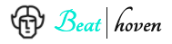
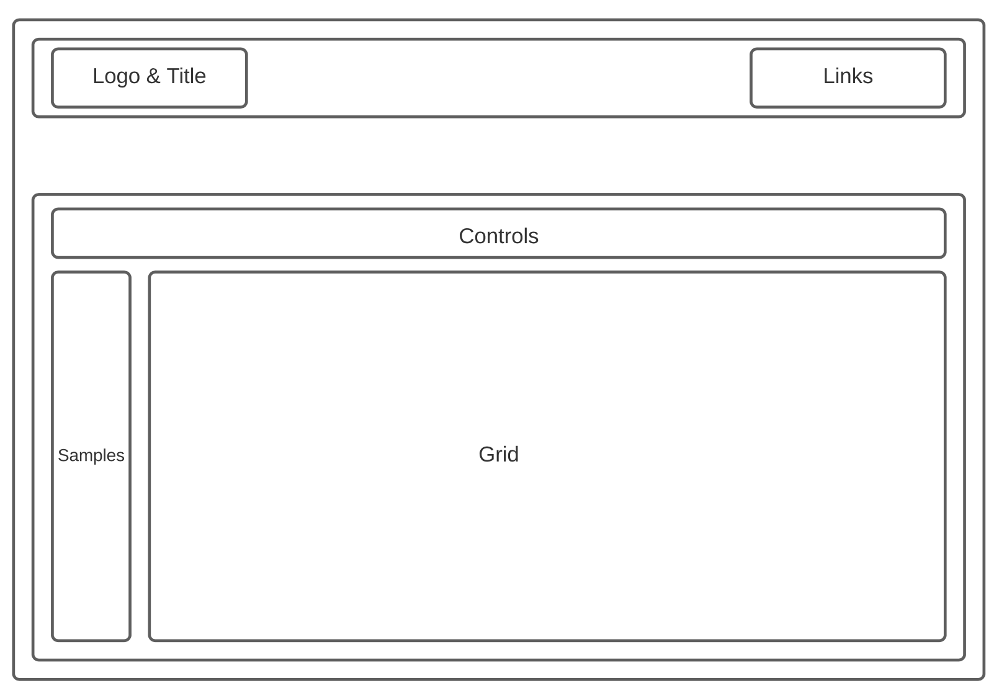
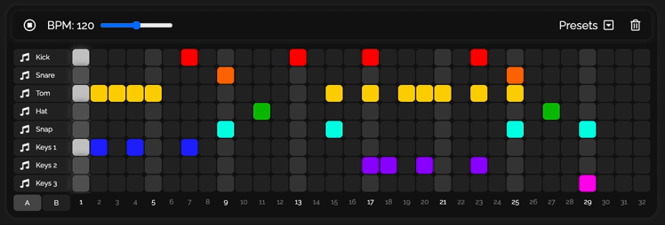
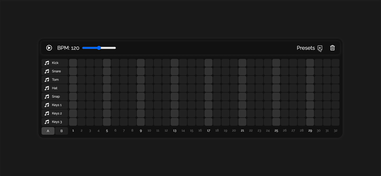

<div align="center">
    
</div>

## Background and Overview 
[Beathoven](https://adamklimmek.github.io/Beathoven/) is an audio sequencer that allows users to easily make instrumental music directly in the browser. It includes various features and functionality, such as the ability to choose from different sound kits, a convenient slider for adjusting BPM, and the option to load built-in presets to get a full sense of what the app can do. The overall functionality and design is complemented by crisp, minimal styling choices that are easy on the eyes while also being clear and engaging to the user. Give it a try and see for yourself!

## Architecture and Technologies
* JavaScript
* HTML
* CSS
* Tone.js

## Wireframes


## Looping Function
<div align="center">
    
</div>

The sequencer grid consists of a series of rows, and each row has 32 pads. By incrementing the variable `columnCounter` at regular intervals and taking its modulo, the function is able to move from one column to the next. After reaching the final column, the `columnCounter` will be incremented once more, `currentColumn` will be set to 0, and the function will continue iterating through each column in the sequencer starting from the beginning again. This is the function's outer loop, and it's what achieves the general 'looping' behavior of the sequencer.

The function's inner loop, meanwhile, iterates through each of the sequencer's rows, and uses `currentColumn` to retrieve the correct pad from each row. Since there are two different sound kits available, some conditional logic gives the function the flexibility to handle sounds loaded from files (`soundKitA`) as well as sounds generated by Tone.Synth objects (`soundKitB`). For each pad in the `currentColumn`, the function checks to see whether the pad's underlying input (a checkbox) is currently checked. If so, the corresponding sound is scheduled to be played at a certain time and, in the case of a Tone.Synth object, for a specified duration. After checking each pad in the current column and scheduling the audio playback as necessary, the `columnCounter` is incremented, the function is called again, and it proceeds with another iteration of its outer loop.

The function also helps manage the timing of visual events related to styling. Tone.Draw uses the same specified time interval to label each pad in the `currentColumn` as 'active'. At the same time, all pads from the `previousColumn` have the label removed. The specifics of how an 'active' pad should be rendered are handled with CSS.

``` javascript
    const rows = Array.from(document.body.querySelectorAll('.sequencer-row'));
    const pitches = ['G3', 'A3', 'B3', 'C4', 'D4', 'E4', 'F4', 'G4', 'A4', 'B4', 'C5', 'D5', 'E5', 'F5', 'G5'].reverse();
    let columnCounter = 0;

    Tone.Transport.scheduleRepeat(runSequence, '16n')

    function runSequence(time) {
        let currentColumn = columnCounter % 32;

        for (let row = 0; row < rows.length; row++) {
            let currentRow = rows[row];
            let currentPad = currentRow.querySelector(`label:nth-child(${currentColumn + 1})`)
            let currentCheckBox = currentPad.querySelector('input')
            
            if (currentSoundKit === 'A') {
                if (row < 8) {
                    let currentSound = soundKitA[row];
                    if (currentCheckBox.checked) currentSound.start(time);
                }
            } else {
                let currentSynth = soundKitB[row];
                let currentPitch = pitches[row]
                if (currentCheckBox.checked) currentSynth.triggerAttackRelease(currentPitch, '16n');
            }
        }

        Tone.Draw.schedule(time => {
            let currentColumnPads = Array.from(document.getElementsByClassName(`col-${currentColumn}`));
            currentColumnPads.forEach(pad => { pad.classList.add('active'); })

            let previousColumn = (currentColumn === 0) ? (31) : (currentColumn - 1);
            let previousColumnPads = Array.from(document.getElementsByClassName(`col-${previousColumn}`));
            previousColumnPads.forEach(pad => { pad.classList.remove('active'); })
        }, time)

        columnCounter++;
    }
```

Lastly, while this may serve as an outline of the function's general behavior, perhaps a bit more can be said about the 'scheduling' of audio playback. Among the other things it provides, Tone.js offers a way to create uniform audio playback with precise timing. First, `Tone.Transport` helps construct a kind of musical timeline, and `scheduleRepeat` is used to arrange audio events at regular intervals in this timeline. `Tone.Transport` can also store a BPM value (which is set to 120 by default). Together, this BPM value and the specified time interval (e.g., '16n') allow Tone to pinpoint when a musical event should occur. With this information in hand, Tone is able to coordinate with the Web Audio API's `AudioContext` and ultimately create synchronized audio playback despite JavaScript's asynchronicity.

## Loading Presets
<div align="center">
    
</div>

To smoothly handle loading a new preset, the `initializePreset()` function proceeds in steps. First, it calls the `clear()` function, which stops playback if the sequencer is currently playing and then iterates through each pad to uncheck its underlying checkbox. From there, the function ensures that the correct sound kit is enabled by calling `enableSoundKitA()` or `enableSoundKitB()`. Since `soundKitA` has eight rows and `soundKitB` has 15, these two functions also toggle a 'hidden' value on rows nine through fifteen of the sequencer. That way, if `currentSoundKit` needs to be updated, the number of rows displayed in the sequencer will be updated, too. Next, `initializePreset()` checks to see if the sequencer's current BPM value needs to be adjusted. If so, it will call `updateBPM()`, passing in the BPM value associated with the specified preset. After handling any changes that need to be made to the BPM value, the function iterates through `correctCheckboxes`, a two-dimensional array passed into the function whichs contains coordinates for each checkbox input that needs to be checked. Lastly, the function calls `play()`, which starts the sequencer up from the beginning.

``` javascript
    function initializePreset(correctSoundKit, correctBPM, correctCheckboxes) {
        clear();

        setTimeout(() => {
            (correctSoundKit === 'A') ? enableSoundKitA() : enableSoundKitB();
        }, 200);
            
        setTimeout(() => {
            if (Tone.Transport.bpm.value !== correctBPM) updateBPM(correctBPM);
        }, 250);

        setTimeout(() => {
            correctCheckboxes.forEach((coords) => {
                let currentBox = document.getElementsByClassName(`row-${coords[0]} col-${coords[1]}`)[0];
                currentBox.checked = true;
            })
        }, 300);

        setTimeout(() => { play() }, 350);
    }
```

It may seem strange to have scheduled each of these steps using `setTimeout()`. Personally, I found that doing so helped minimize visual inconsistencies caused by loading a new preset while the sequencer is already playing. Ultimately, the `initializePreset()` function reliably accounts for a host of different variables, quickly handles all necessary changes for the user, and does all of this while minimizing visual inconsistencies associated with the styling logic in the looping function.

### Upcoming Features:
The following is a list of additional features I would like to add to the site in the future:
* More sound kits
* Dynamic resizing of the sequencer based on screen size
* Voice recording and synchronized vocal playback over the audio sequencer
* Option to save custom beats/loops for future playback